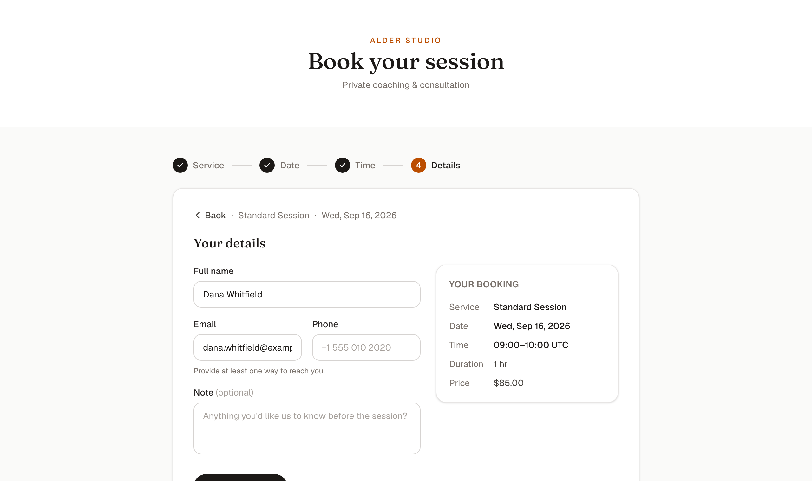
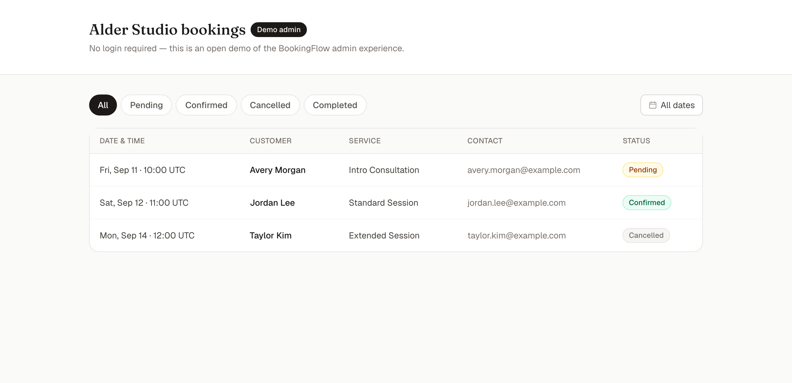
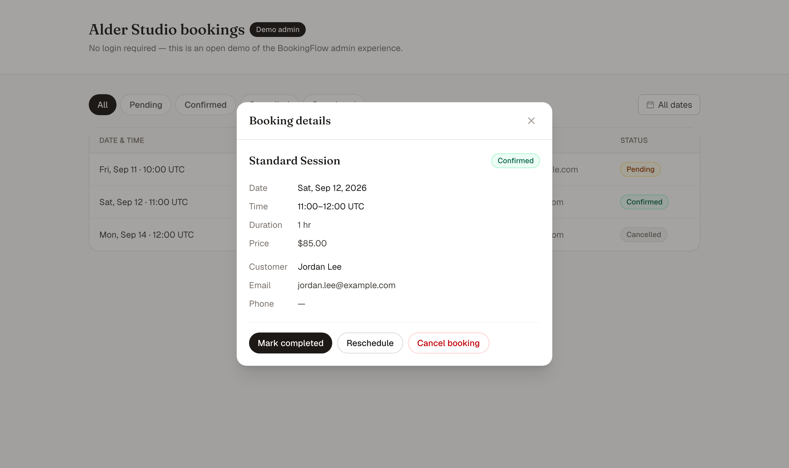
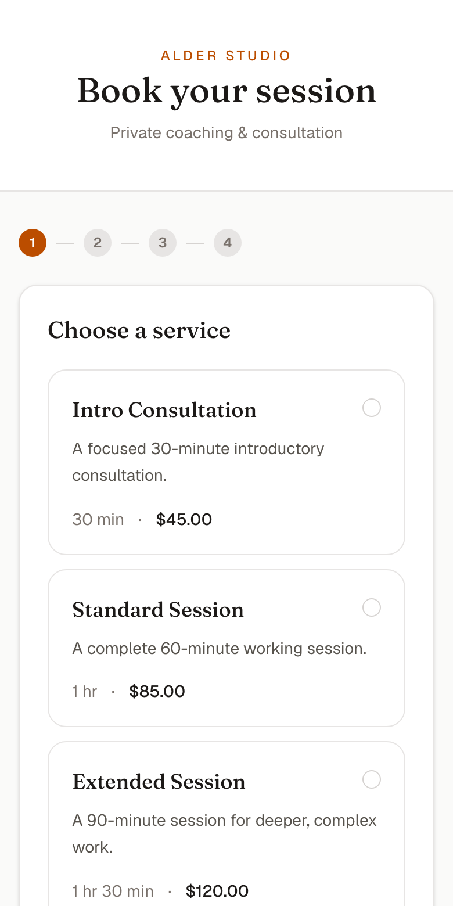

# BookingFlow

**A full-stack appointment booking system for small service businesses** — consultants,
coaches, trainers, therapists, tutors, and studios that sell time in slots.

Customers pick a service, a date, and an open time, leave their contact details, and
book. The business runs everything from one open admin screen: review requests, confirm,
reschedule, complete, or cancel. The backend keeps availability duration-aware and refuses
to double-book a slot.

- **Who it's for:** any appointment-based team that currently juggles bookings over
  email, DMs, or a spreadsheet.
- **The problem it solves:** no double bookings, no "are you free Tuesday?" back-and-forth,
  and one place to see the day.
- **What you can try:** the full customer booking flow and the full admin workflow, with
  realistic seed data, in about two minutes (see [Demo walkthrough](docs/DEMO.md)).
- **Stack:** FastAPI + PostgreSQL on the backend, Next.js + TypeScript on the frontend,
  wired together with Docker Compose.
- **Where's the demo:** it runs locally with a single `docker compose up` — see
  [Run locally](#run-locally). There is no hosted URL yet (see
  [Project scope](#project-scope--portfolio-note)).

> Portfolio demo. Fictional business ("Alder Studio") and fictional customers. Not a
> production SaaS — the admin is intentionally open with no login.

---

## Screenshots

| Customer booking flow | Admin dashboard |
| --- | --- |
|  |  |

| Admin — booking detail & actions | Mobile booking flow |
| --- | --- |
|  |  |

---

## Business problem

Small service businesses lose time and revenue to booking friction:

- **Double bookings** when two people claim the same slot.
- **Manual back-and-forth** to find a time that works.
- **No single view** of what the day or week looks like.
- **Ad-hoc rescheduling** that leaves the old slot blocked or the new one conflicting.

## Solution

BookingFlow is a small, complete booking system that handles the whole loop:

- A guided public booking flow that only ever offers **real, open** times.
- An open admin dashboard to triage and manage every booking.
- Server-side overlap validation that rejects an intersecting appointment on every booking
  request, plus a database uniqueness constraint on the start time that removes the
  identical-start race.

## Customer flow

`Service → Date → Time → Your details → Confirmation`

1. **Service** — choose from the offered services (name, duration, price).
2. **Date** — pick any day inside the booking window (today through +30 days).
3. **Time** — pick from the open 30-minute-grid slots for that day and service. Times
   already taken, or too late in the day for the full duration, are not shown.
4. **Your details** — name plus at least one of email or phone, and an optional note. A
   live summary shows the service, date, time, duration, and price.
5. **Confirmation** — the booking is created as **pending** and the customer gets a
   summary to keep.

## Admin workflow

The admin dashboard (`/admin`) lists every booking and supports:

- **Filter** by status (pending / confirmed / cancelled / completed) and by date.
- **Open** a booking to see the service, time, customer, and note.
- **Confirm** a pending request.
- **Reschedule** a pending or confirmed booking to another open time (the same
  availability and no-overlap rules apply; the old time is released).
- **Mark completed** a confirmed booking.
- **Cancel** a pending or confirmed booking (its time is released back to availability).

## Important business rules

- **Business hours:** Monday–Saturday, 09:00–18:00 UTC. Sunday is closed.
- **Slot grid:** bookings start on the :00 or :30 mark.
- **Duration-aware:** the whole service must finish by 18:00, so a 90-minute service
  can't start after 16:30.
- **Booking window:** today through today + 30 days; past times are never offered.
- **No overlap:** a time is unavailable if it overlaps any booking that isn't cancelled.
  Cancelling a booking frees its time again.
- **Status lifecycle:** `pending → confirmed → completed`, with `cancelled` reachable from
  pending or confirmed. `cancelled` and `completed` are final.
- **Overlap handling:** the API validates interval overlap on every create and reschedule
  and returns `409` for an intersecting appointment. A database unique index on the
  `start_at` of non-cancelled bookings adds a backstop for two requests racing on the
  **same start time** — it is a plain uniqueness constraint, not a PostgreSQL exclusion
  constraint, so it does not by itself prevent overlaps between bookings that start at
  different times.

## Architecture / stack

| Layer | Technology |
| --- | --- |
| Frontend | Next.js (App Router) + TypeScript + Tailwind CSS |
| Backend | FastAPI + SQLAlchemy + Alembic |
| Database | PostgreSQL 16 |
| Local orchestration | Docker Compose (`db`, `backend`, `frontend`) |

- Two frontend routes: `/` (booking flow) and `/admin` (dashboard).
- A small, frozen JSON API — services, availability, public booking creation, and admin
  read / status / reschedule. Full shape in [`docs/api-contract.md`](docs/api-contract.md).
- All times are stored and returned in UTC.
- The backend seeds a fresh database with demo services and bookings on startup, so the
  stack is useful the moment it comes up.

## Run locally

Requires Docker.

```bash
cp .env.example .env
docker compose up --build
```

- Customer booking flow: <http://localhost:3000/>
- Admin dashboard: <http://localhost:3000/admin>
- API health: <http://localhost:8000/health>

The database is seeded automatically. Stop with `Ctrl+C`; add `-v` to
`docker compose down` if you want to wipe the demo data and re-seed on the next start.

## Demo walkthrough

A scripted 2–4 minute path that shows the whole product — booking, admin triage,
reschedule, completion, and the double-booking guard — is in
[`docs/DEMO.md`](docs/DEMO.md).

## Project scope / portfolio note

This is a **portfolio demo**, built to show a complete, honest full-stack slice:

- Everything in the screenshots and the demo is real — a real FastAPI backend, real
  PostgreSQL persistence, real availability math, and a real Next.js UI.
- Data is fictional. "Alder Studio" and every customer name are made up.
- The admin is deliberately open (no authentication) so the demo is one click to explore.
- There is **no public hosted URL**. A full-stack deployment (PostgreSQL + API + web)
  needs a hosting account, which isn't available for this demo, so the reproducible
  `docker compose up` above is the intended way to run it.

Out of scope by design (and good candidates for a real build): authentication and staff
accounts, payments, email/SMS notifications, calendar sync, multi-staff resources, and a
service-management UI. See [`docs/CASE_STUDY.md`](docs/CASE_STUDY.md) for the fuller
write-up.

---

## Developer reference

Contract: [`docs/api-contract.md`](docs/api-contract.md).

Backend, without Docker:

```bash
cd backend
python3 -m venv .venv
.venv/bin/pip install -e '.[dev]'
.venv/bin/alembic upgrade head
.venv/bin/python -m app.seed
.venv/bin/uvicorn app.main:app --reload
```

Backend checks (the fast suite runs on SQLite; set `TEST_DATABASE_URL` to a disposable
PostgreSQL database to run the same suite there — it recreates its tables and must not be
pointed at a development or production database):

```bash
.venv/bin/pytest -q
.venv/bin/ruff check .
.venv/bin/ruff format --check .
```

Frontend:

```bash
cd frontend
npm ci
npm run lint
npm run build
```
